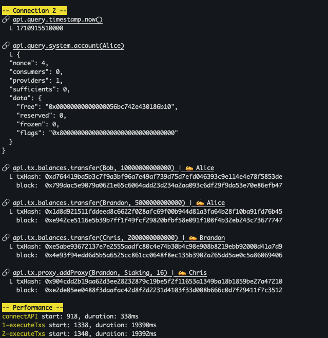

# Substrate RPC Tester

<div>
  <a href="https://www.loom.com/share/4440ff6d68a8437d80890817d5823021">
    <p>Substrate RPC Tester 视频讲解 🎥 - Watch Video</p>
  </a>
  <a href="https://www.loom.com/share/4440ff6d68a8437d80890817d5823021">
    
  </a>
</div>

This tool connects to a series of Substrate RPC endpoints and sending a script of transactions to these endpoints.

To run the tester, you have to [install Deno](https://docs.deno.com/runtime/manual/getting_started/installation).

After cloning the repository, you can use it as:

```bash
deno task start
```

It will use the current [`config.ts`](./src/config.ts) for the connections and transaction scripts.

## Configuration

An example of the config is as follows:

```ts
const Config: AppConfig = {
  keyring: {
    // see: https://github.com/paritytech/ss58-registry/blob/main/ss58-registry.json
    type: "sr25519",
    ss58Format: 11330,
  },
  // "none" | "inBlock" | "finalized"
  writeTxWait: "none",
  endPoints: [
    "ws://127.0.0.1:9944",
    // "wss://testnet-rpc1.cess.cloud/ws/",
    // "wss://rpc.polkadot.io"
  ],
  connections: 5,
  txs: [
    "api.query.timestamp.now",
    {
      tx: "api.query.system.account",
      params: ["Alice"],
    },
    {
      // Alice transfers to Bob
      tx: "api.tx.balances.transfer",
      params: ["Bob", 12345],
      signer: "Alice",
    },
    {
      // Bob transfers back to Alice
      tx: "api.tx.balances.transfer",
      params: ["Alice", 12345],
      signer: "Bob",
    },
    {
      // Alice adding Bob as proxy
      tx: "api.tx.proxy.addProxy",
      // (address, Staking type, BlockNumber)
      params: ["Bob", "Staking", 16],
      signer: "Alice",
    },
  ],
};
```

- Here, we set the **keyring** type to be `sr25519` and ss58 network prefix of `11330`. This is the network prefix of [CESS Testnet](https://github.com/paritytech/ss58-registry/blob/57920666a85e0ec28bf47bdbc9f9317a87649988/ss58-registry.json#L1237-L1245).

- **writeTxWait**: it can be `["none" | "inBlock" | "finalized"]`. This determines the behavior of what happen after sending write transactions to the endpoint. `none` is not waiting. `inBlock` is wait till the tx is included in a block. `finalized` is wait till the tx is finalized.

- **endPoints**: an array of RPC endpoints that the script is connecting to.

- **connections**: number of connections connecting to each endpoint specified in endPoints. So if you specify 2 endpoints in **endPoints**, and a value of 5 here. A total of 2 x 5 = 10 connections will be generated.

- **txs**: the transactions to be sent over. It can be a string (if no parameters), or an object. It is pretty self explanatory. If you are connecting to a development network/node, you can use `Alice`, `Bob`, `Charlie`, etc well-known accounts.

## Performance Report



A primitive performance report is generated at the end on establishing the connections and executing all the transactions.

**Todo**: future improvement.
